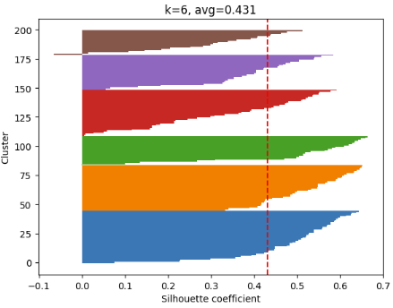
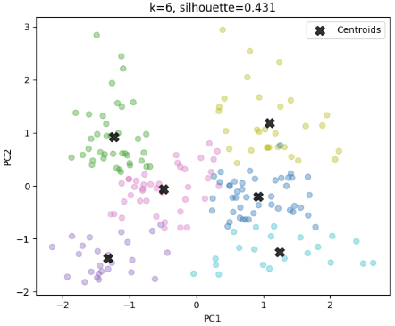
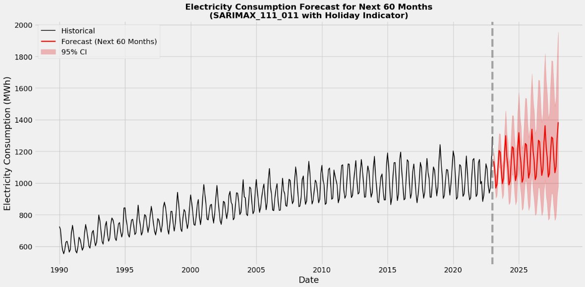
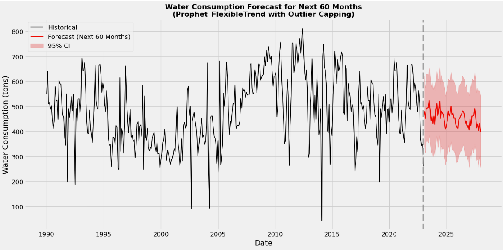
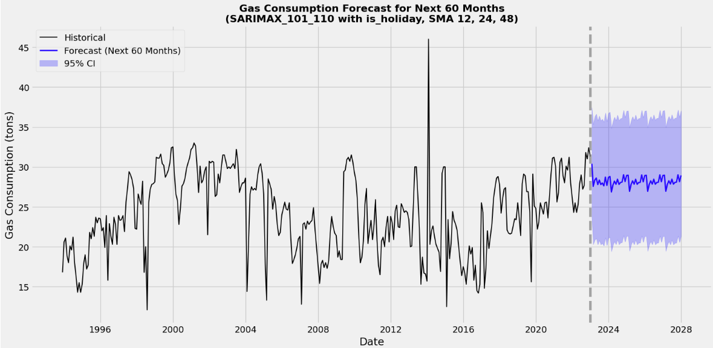

# AIML CA2 — Clustering & Time-Series Forecasting

---

## Contents
- [Task](#task)
- [Part A — Customer Segmentation (Clustering)](#part-a--customer-segmentation-clustering)
  - [Data Understanding & EDA](#data-understanding--eda)
  - [Feature Engineering & Selection](#feature-engineering--selection)
  - [Finding the Right K](#finding-the-right-k)
  - [Model Selection & Results](#model-selection--results)
  - [Cluster Interpretation](#cluster-interpretation)
- [Part B — Energy Consumption Forecasting (Time-Series)](#part-b--energy-consumption-forecasting-time-series)
  - [Stationarity & Transformations](#stationarity--transformations)
  - [Model Selection Per Utility](#model-selection-per-utility)
  - [SARIMAX & Exogenous Features](#sarimax--exogenous-features)
  - [Forecasting Results](#forecasting-results)
- [Conclusion](#conclusion)

---

## Task

**Part A — Clustering**

> *"Which types of customers does this mall actually have?"*

A mall wants to understand its customer base to run more targeted marketing campaigns. The dataset contains customer records with age, annual income, and a spending score. The goal is to use unsupervised learning to uncover natural groupings and turn them into actionable business profiles.

**Part B — Time-Series Forecasting**

> *"Can we forecast Singapore's electricity, water, and gas consumption 60 months into the future?"*

Singapore's energy planning team needs long-range forecasts of utility consumption to support infrastructure and policy decisions. Monthly consumption records across electricity, water, and gas are modelled separately, since each utility has different statistical properties.

---

## Part A — Customer Segmentation (Clustering)

### Data Understanding & EDA

The dataset has 200 mall customer records with 5 features: CustomerID, Gender, Age, Annual Income, and How Much They Spend.

EDA revealed that `How Much They Spend` is an engineered spending score, not raw expenditure — an important distinction for interpretation. Distributions, correlation heatmaps, and pairplots were used to understand feature relationships before modelling.

---

### Feature Engineering & Selection

Two features were tested for potential inclusion:
- `Gender` (encoded)
- `Spend_Income_Ratio` (engineered feature)

Both were excluded after controlled experiments showed only marginal improvements in Silhouette Score and visually messier clusters. Simpler features gave cleaner segments.

**Outlier handling:** IsolationForest was used to assess outliers — they were kept, as they represent genuine edge-case customer segments rather than noise.

---

### Finding the Right K

Five methods were run in parallel to determine the optimal number of clusters:

| Method | Result |
|---|---|
| Elbow Method | k = 6 |
| Silhouette Score | k = 6 |
| Silhouette Plot | k = 6 |
| Davies-Bouldin Index | k = 6 |
| Calinski-Harabasz Score | k = 6 |

All five methods agreed — **optimal k = 6**.

---

### Model Selection & Results

KMeans and Agglomerative Clustering (with dendrogram analysis) were compared across three metrics:

| Metric | KMeans | Agglomerative |
|---|---|---|
| Silhouette Score | ✅ Higher | Lower |
| Davies-Bouldin Index | ✅ Lower | Higher |
| Calinski-Harabasz | ✅ Higher | Lower |

**KMeans won across all three.** Final clusters were visualised with both PCA and t-SNE (multiple perplexity/learning rate permutations tested).

---

### Cluster Interpretation

The 6 clusters were mapped into actionable customer profiles:

| Cluster | Profile | Key Trait |
|---|---|---|
| 0 | Young & Impulsive Splurgers | High spend, low income |
| 1 | Cautious Shoppers | Low spend, low income |
| 2 | Old Balanced Shoppers | Mid spend, high income, older |
| 3 | Premium Loyalists | High spend, high income |
| 4 | Budget Seniors | Low spend, mid income, older |
| 5 | Mid-tier Mainstream | Average across the board |

These profiles directly inform marketing targeting — e.g. upsell campaigns for Premium Loyalists, loyalty perks for Cautious Shoppers.

---

## Part B — Energy Consumption Forecasting (Time-Series)

### Stationarity & Transformations

Each utility's time series was tested for stationarity using both **ADF and KPSS tests**, supported by rolling mean/variance plots. Since they disagreed in some cases, both were used together to confirm conclusions.

Transformations applied before modelling:

| Utility | Transformation |
|---|---|
| Electricity | Log transform + seasonal differencing |
| Water | Minimal (Prophet handles this internally) |
| Gas | Box-Cox + first-order + seasonal differencing |

---

### Model Selection Per Utility

ACF and PACF plots were used to manually identify ARIMA parameters, cross-referenced with Auto-ARIMA as a sanity check for ambiguous cases.

**⚡ Electricity — SARIMA**

Iteratively improved from `(0,1,1)(0,1,1,12)` → `(0,1,3)(0,1,3,12)` based on residual analysis and AIC.

| Model | Test MAPE |
|---|---|
| SARIMA `(0,1,1)(0,1,1,12)` | ~1.2% |
| SARIMA `(0,1,3)(0,1,3,12)` | **0.38%** ✅ |

**💧 Water — Meta Prophet**

SARIMA struggled with water's irregular anomalies. Prophet's flexible trend component handled this better and produced more stable forecasts.

**🔥 Gas — SARIMA (after comparison)**

Three models were compared: ARIMA, Holt-Winters, and SARIMA. SARIMA was selected based on lowest test MAPE and better residual behaviour.

---

### SARIMAX & Exogenous Features

For gas, the model was upgraded from SARIMA to **SARIMAX** by engineering exogenous features:
- Singapore public holiday indicators
- Multi-scale SMA features (12/24/48-month rolling averages)

| Model | Test MAPE | Confidence Interval |
|---|---|---|
| SARIMA | Baseline | Wider |
| SARIMAX | **-2.76% improvement** ✅ | Tighter |

GridSearch hyperparameter tuning was then applied to finalise parameters.

---

### Forecasting Results

60-month future forecasts were generated for all three utilities, with inverse transforms applied to return predictions to original scale.

| Utility | Model | Test MAPE |
|---|---|---|
| Electricity | SARIMA `(0,1,3)(0,1,3,12)` | 0.38% |
| Water | Prophet | — |
| Gas | SARIMAX | — |

---

## Conclusion

Part A demonstrated how unsupervised clustering can extract real business value. Going from raw customer data to 6 distinct, actionable profiles meant that a marketing team can act immediately.

Part B showed that one-size-fits-all modelling doesn't work for time series. Each utility needed a different approach based on its statistical properties. SARIMAX with engineered exogenous features pushed gas forecasting accuracy meaningfully further than baseline SARIMA. Meta Prophet model helped to address the large presence of outliers in water consumption data.

Both parts followed a structured, end-to-end workflow: data understanding → feature decisions → model selection with justification → results interpretation.